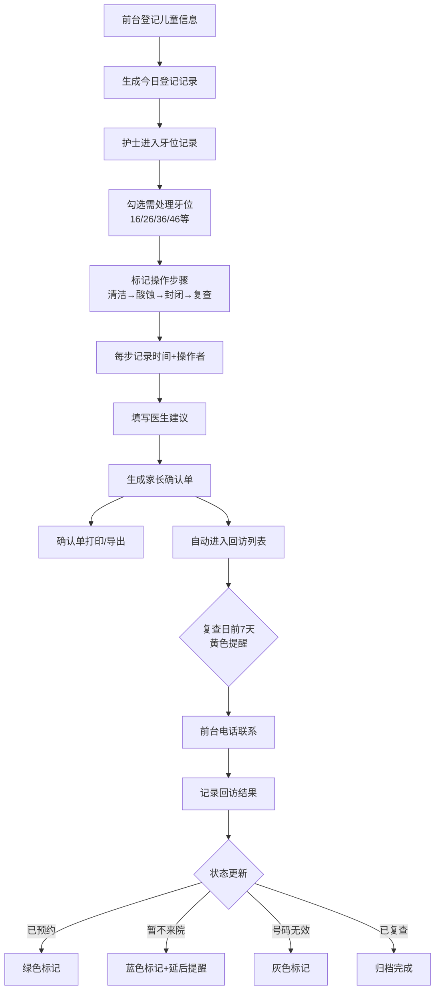

## 1. 产品概述

面向口腔诊所前台和儿童牙科护士的窝沟封闭登记管理系统，解决儿童到院后窝沟封闭项目登记不清、牙位记录遗漏、回访跟进不及时的问题。
- 核心目标：把到院儿童的窝沟封闭项目登记做得清楚不漏，形成完整的就诊闭环
- 目标用户：诊所前台（登记录入、回访跟进）、儿童牙科护士（牙位记录、操作步骤标记）
- 产品价值：标准化登记流程、减少操作遗漏、提升复诊率、降低管理成本

## 2. 核心功能

### 2.1 用户角色

| 角色 | 登录方式 | 核心权限 |
|------|----------|----------|
| 诊所前台 | 本地系统登录 | 儿童信息登记录入、回访提醒管理、电话记录、确认单打印 |
| 牙科护士 | 本地系统登录 | 牙位勾选记录、操作步骤标记、医生建议填写、确认单生成 |

### 2.2 功能模块

1. **今日登记页面**：儿童信息录入表单、当日登记列表、快速搜索筛选
2. **牙位记录页面**：交互式牙位图、操作步骤状态标记、时间/操作者记录、家长确认单生成
3. **回访提醒页面**：复查日期提醒列表、回访状态标记、电话结果记录、跟进统计

### 2.3 页面详情

| 页面名称 | 模块名称 | 功能描述 |
|-----------|-------------|---------------------|
| 今日登记 | 顶部统计栏 | 显示今日登记人数、首次封闭人数、复查人数统计卡片 |
| 今日登记 | 快速录入表单 | 儿童姓名、年龄、家长电话、学校/来源渠道、是否首次封闭、备注信息 |
| 今日登记 | 当日登记列表 | 展示当日所有登记儿童，支持搜索、筛选、操作（进入牙位记录/删除） |
| 今日登记 | 渠道统计 | 饼图展示各来源渠道分布，辅助运营分析 |
| 牙位记录 | 儿童信息卡 | 显示当前儿童基本信息，返回入口 |
| 牙位记录 | 交互式牙位图 | 恒牙位图（重点标记16/26/36/46），点击勾选需处理牙位，支持多选 |
| 牙位记录 | 操作步骤面板 | 每个牙位对应四步操作：已清洁→已酸蚀→已封闭→需复查，每步记录时间和操作者 |
| 牙位记录 | 医生建议区 | 自由文本输入医生术后建议、注意事项 |
| 牙位记录 | 确认单预览 | 实时预览家长确认单内容，含封闭牙位、建议、复查日期、二维码 |
| 牙位记录 | 完成操作 | 保存记录并生成可打印确认单，自动排入回访列表 |
| 回访提醒 | 时间筛选器 | 按复查日期范围筛选（本周内/本月内/全部） |
| 回访提醒 | 回访列表 | 按复查日期排序，未联系儿童黄色高亮，逾期红色标记 |
| 回访提醒 | 回访记录弹窗 | 记录电话结果：已预约/暂不来院/号码无效/已复查/其他，支持备注 |
| 回访提醒 | 状态统计 | 顶部统计：待联系、已预约、暂不来院、号码无效、已完成等数量 |
| 回访提醒 | 快速操作 | 一键拨号（tel协议）、查看完整就诊记录、修改复查日期 |

## 3. 核心流程

### 3.1 登记→操作→确认流程
前台录入儿童基本信息并提交→系统创建登记记录并跳转牙位记录页→护士在牙位图上勾选需处理牙位→依次为每个牙位标记操作步骤（清洁/酸蚀/封闭/复查）→每步自动记录时间和操作者→填写医生建议→生成家长确认单→完成后自动进入回访提醒列表

### 3.2 回访跟进流程
系统根据复查日期自动排序展示→前台看到黄色高亮的待联系儿童→点击拨打家长电话→记录沟通结果（已预约/暂不来院/号码无效）→系统更新状态颜色→持续跟进直至完成复查或标记终止

## 4. 用户界面设计

### 4.1 设计风格
- 主色调：医疗蓝 `#2563EB`（信任、专业），辅助色：柔和薄荷绿 `#10B981`（安全、健康）、温暖橙 `#F59E0B`（提醒、关注）
- 按钮风格：圆角8px，主色填充按钮带微阴影，悬停时轻微上浮
- 字体方案：标题使用 Noto Sans SC（中文友好），正文使用系统无衬线字体，字号14px为基准
- 布局风格：顶部导航+左侧页面切换的双栏布局，内容区使用卡片式模块，阴影层次分明
- 图标风格：使用 Lucide 线性图标，与医疗主题呼应，状态标记使用彩色圆点+徽章

### 4.2 页面设计概述

| 页面名称 | 模块名称 | UI元素 |
|-----------|-------------|-------------|
| 今日登记 | 统计卡片 | 渐变背景+大数字+图标，悬浮动画效果 |
| 今日登记 | 录入表单 | 双列表单布局，必填项红星标记，输入框圆角聚焦效果 |
| 今日登记 | 登记列表 | 斑马纹表格，操作列按钮，行悬停高亮，空状态插画 |
| 牙位记录 | 牙位图 | SVG交互式恒牙位图，16/26/36/46用虚线框突出，点击缩放反馈 |
| 牙位记录 | 步骤面板 | 时间线式布局，每步可勾选，勾选后自动填充当前时间和用户名 |
| 牙位记录 | 确认单 | A4纸张样式卡片，虚线裁切边，带诊所logo位置和签名区 |
| 回访提醒 | 状态徽章 | 彩色圆角徽章：黄/待联系、绿/已预约、蓝/暂不、灰/无效、红/逾期 |
| 回访提醒 | 列表行 | 左侧状态色条，儿童姓名+电话可点击拨号，右侧操作按钮组 |

### 4.3 响应式设计
- 采用桌面优先设计（Desktop-First），目标分辨率 1366×768 及以上
- 平板端（≥768px）：导航栏收窄，表单单列布局，列表精简列数
- 移动端：标签式底部导航，卡片瀑布流，牙位图自适应缩放
- 所有交互元素触摸尺寸≥44px，确保触屏可操作

### 4.4 动效设计
- 页面切换：淡入+轻微向上位移（20px），时长250ms
- 牙位勾选：点击后 SVG 路径描边动画（填充色过渡200ms）+轻微缩放1.05倍
- 状态标记切换：徽章颜色渐变过渡，数字计数滚动动画
- 表单提交：按钮loading旋转→对勾弹出→成功提示滑入
- 回访列表行：黄色待联系行缓慢呼吸光晕效果（不透明度脉动）
