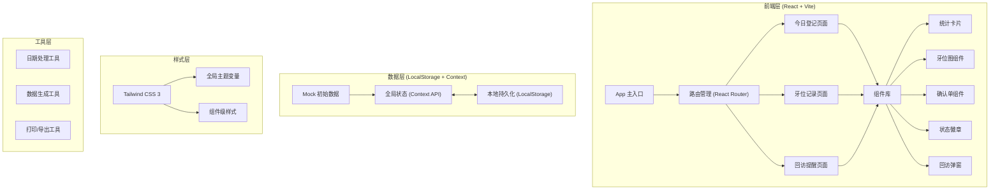
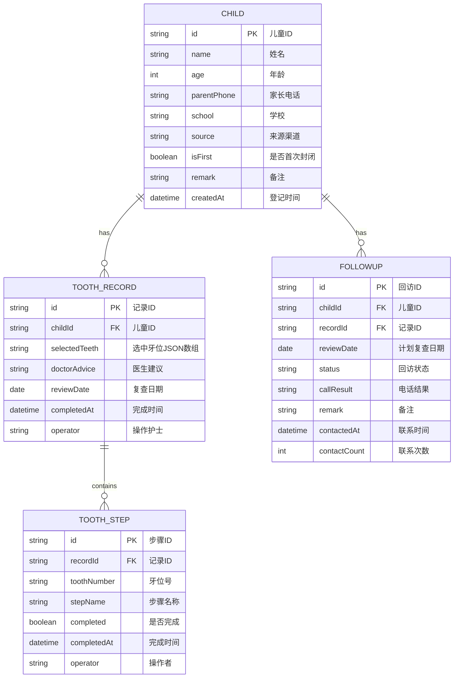

## 1. 架构设计



## 2. 技术说明

- 前端框架：React 18 + React Router DOM 6
- 构建工具：Vite 5（快速冷启动、HMR 热更新）
- 样式方案：Tailwind CSS 3 + PostCSS + Autoprefixer
- 图标库：Lucide React（线性医疗风格图标）
- 数据存储：浏览器 LocalStorage（无需后端，本地持久化）
- 状态管理：React Context API + useReducer（全局数据管理）
- 日期处理：dayjs（轻量级日期库）
- 打印功能：window.print() + 专用打印样式

## 3. 路由定义

| 路由路径 | 页面名称 | 核心功能 |
|----------|----------|----------|
| `/` 或 `/today` | 今日登记 | 儿童信息录入、当日登记列表、统计展示 |
| `/tooth/:id` | 牙位记录 | 牙位勾选、操作步骤标记、确认单生成 |
| `/followup` | 回访提醒 | 复查列表、回访记录、状态统计 |

## 4. 数据模型

### 4.1 数据模型定义



### 4.2 数据结构（TypeScript 接口）

```typescript
// 儿童登记信息
interface ChildRecord {
  id: string;
  name: string;
  age: number;
  parentPhone: string;
  school: string;
  source: '学校体检' | '家长介绍' | '网络推广' | '门诊路过' | '其他';
  isFirst: boolean;
  remark: string;
  createdAt: string;
  status: 'registered' | 'in_progress' | 'completed';
}

// 牙位操作步骤
interface ToothStep {
  tooth: string;
  step: 'cleaned' | 'etched' | 'sealed' | 'review';
  completed: boolean;
  time: string | null;
  operator: string | null;
}

// 牙位记录
interface ToothRecord {
  id: string;
  childId: string;
  selectedTeeth: string[];
  steps: ToothStep[];
  doctorAdvice: string;
  reviewDate: string;
  completedAt: string | null;
  operator: string;
}

// 回访记录
interface FollowupRecord {
  id: string;
  childId: string;
  toothRecordId: string;
  reviewDate: string;
  status: 'pending' | 'contacted' | 'appointed' | 'postponed' | 'invalid' | 'done';
  callResult?: '已预约' | '暂不来院' | '号码无效' | '已复查' | '其他';
  remark?: string;
  contactedAt?: string;
  contactCount: number;
}

// 全局状态
interface AppState {
  children: ChildRecord[];
  toothRecords: ToothRecord[];
  followups: FollowupRecord[];
  currentOperator: string;
}
```

### 4.3 初始 Mock 数据

```json
{
  "currentOperator": "李护士",
  "children": [
    {
      "id": "c001",
      "name": "张小明",
      "age": 7,
      "parentPhone": "138****1234",
      "school": "阳光小学",
      "source": "学校体检",
      "isFirst": true,
      "remark": "有点紧张，需要耐心引导",
      "createdAt": "2026-06-20T09:15:00",
      "status": "completed"
    },
    {
      "id": "c002",
      "name": "王朵朵",
      "age": 8,
      "parentPhone": "139****5678",
      "school": "育才一小",
      "source": "家长介绍",
      "isFirst": false,
      "remark": "上次配合很好",
      "createdAt": "2026-06-20T10:30:00",
      "status": "in_progress"
    },
    {
      "id": "c003",
      "name": "刘子豪",
      "age": 6,
      "parentPhone": "137****9012",
      "school": "实验幼儿园",
      "source": "网络推广",
      "isFirst": true,
      "remark": "",
      "createdAt": "2026-06-20T11:00:00",
      "status": "registered"
    }
  ],
  "followups": [
    {
      "id": "f001",
      "childId": "c001",
      "toothRecordId": "t001",
      "reviewDate": "2026-06-27",
      "status": "pending",
      "contactCount": 0
    },
    {
      "id": "f002",
      "childId": "c002",
      "toothRecordId": "t002",
      "reviewDate": "2026-06-25",
      "status": "appointed",
      "callResult": "已预约",
      "contactedAt": "2026-06-20T14:00:00",
      "contactCount": 1,
      "remark": "预约6月28日上午"
    }
  ]
}
```

## 5. 组件结构

```
src/
├── App.tsx                    # 主应用，路由配置
├── main.tsx                   # 入口文件
├── index.css                  # 全局样式 + Tailwind 指令
├── context/
│   └── AppContext.tsx         # 全局状态管理 Context
├── pages/
│   ├── TodayRegistration.tsx  # 今日登记页面
│   ├── ToothRecord.tsx        # 牙位记录页面
│   └── FollowupReminder.tsx   # 回访提醒页面
├── components/
│   ├── Layout/
│   │   ├── Sidebar.tsx        # 左侧导航
│   │   └── Header.tsx         # 顶部栏
│   ├── Today/
│   │   ├── StatsCard.tsx      # 统计卡片
│   │   ├── RegistrationForm.tsx # 录入表单
│   │   └── ChildrenList.tsx   # 儿童列表
│   ├── Tooth/
│   │   ├── ToothChart.tsx     # 交互式牙位图
│   │   ├── StepPanel.tsx      # 操作步骤面板
│   │   └── ConfirmationSlip.tsx # 家长确认单
│   ├── Followup/
│   │   ├── StatusFilter.tsx   # 状态筛选
│   │   ├── FollowupList.tsx   # 回访列表
│   │   └── CallModal.tsx      # 回访记录弹窗
│   └── common/
│       ├── StatusBadge.tsx    # 状态徽章
│       ├── EmptyState.tsx     # 空状态
│       └── Toast.tsx          # 消息提示
├── utils/
│   ├── storage.ts             # LocalStorage 工具
│   ├── date.ts                # 日期处理工具
│   └── mockData.ts            # Mock 数据生成
└── types/
    └── index.ts               # TypeScript 类型定义
```
